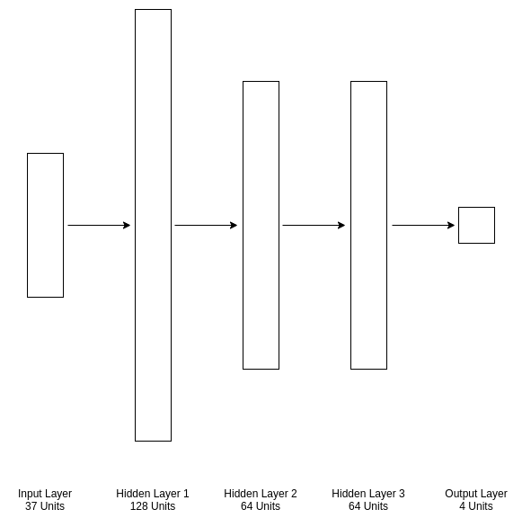
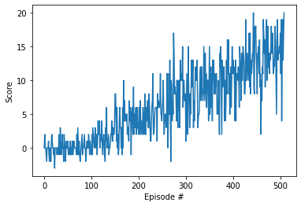

# Report

## Learning Algorithm

A Deep Q-Network was used to solve this task. The model architecture chosen consists of three fully connected hidden layers. The hidden layers consist of 128, 64, and 64 units respectively. The output layer consists of four units corresponding to the four actions the agent can take.

The hyperparameters used in this task are summarized in this table:

|Hyperparameter| Value         |
|:-------------|:--------------|
|Learning Rate | 0.0005        |
|Epsilon Start | 1.0           |
|Epsilon End   | 0.01          |
|Epsilon Decay | 0.995         |
|Gamma         | 0.99          |
|Buffer Size   | 100000        |

## Plot of rewards
This plot shows the rewards received during training until the environment was solved, i.e., an average rewards of +13 over the past 100 episodes was received. The environment was solved after 526 episodes.
 

