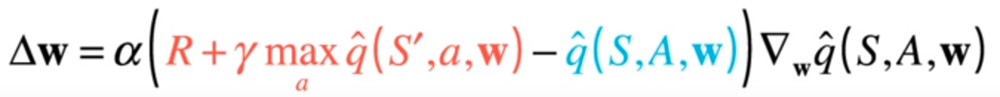

# Report

## Learning Algorithm

A Deep Q-Network was used to solve this task. The Q-Network learns to represent the action-value
function of the states, i.e. what the expected future reward is for being in state S, and choosing
action A. The model architecture chosen consists of three fully connected hidden layers. The hidden
layers consist of 128, 64, and 64 units respectively (see figure below). The output layer consists
of four units corresponding to the four actions the agent can take.

The hyperparameters used in this task are summarized in this table:

|Hyperparameter| Value         |
|:-------------|:--------------|
|Learning Rate | 0.0005        |
|Epsilon Start | 1.0           |
|Epsilon End   | 0.01          |
|Epsilon Decay | 0.995         |
|Gamma         | 0.99          |
|Buffer Size   | 100000        |

The update rule for the DQN is:

## Plot of rewards
This plot shows the rewards received during training until the environment was solved, i.e., an
average rewards of +13 over the past 100 episodes was received. The environment was solved after 526
episodes.

## Future work

To improve the agent's performance, one can think of implementing prioritized experience replay,
instead of uniformly sampling experience from the replay memory buffer. Additionally, using a Double
DQN (DDQN) can help avoid the overestimation of the Q-values.
